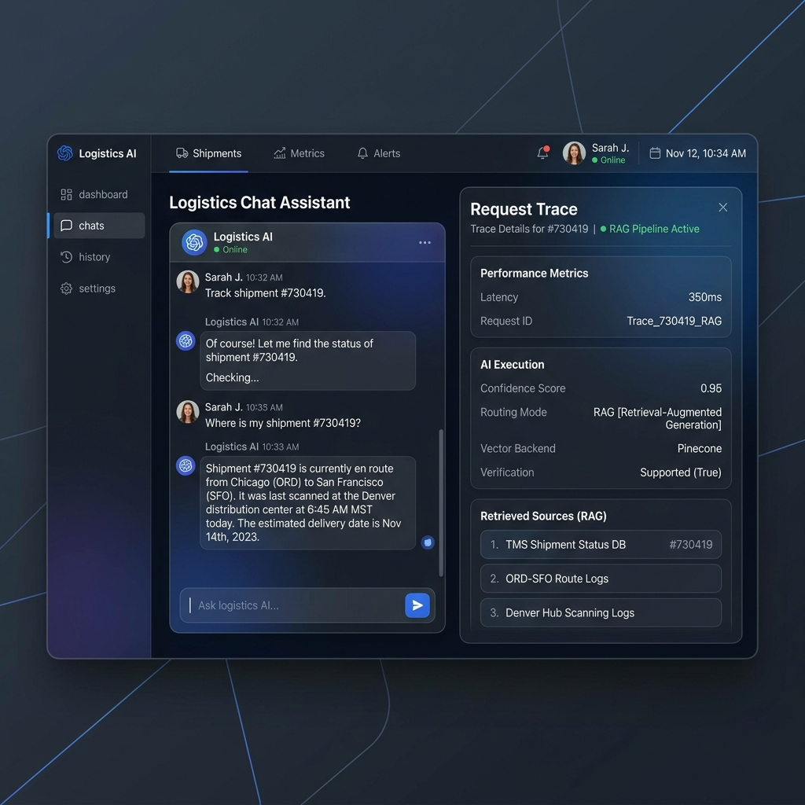
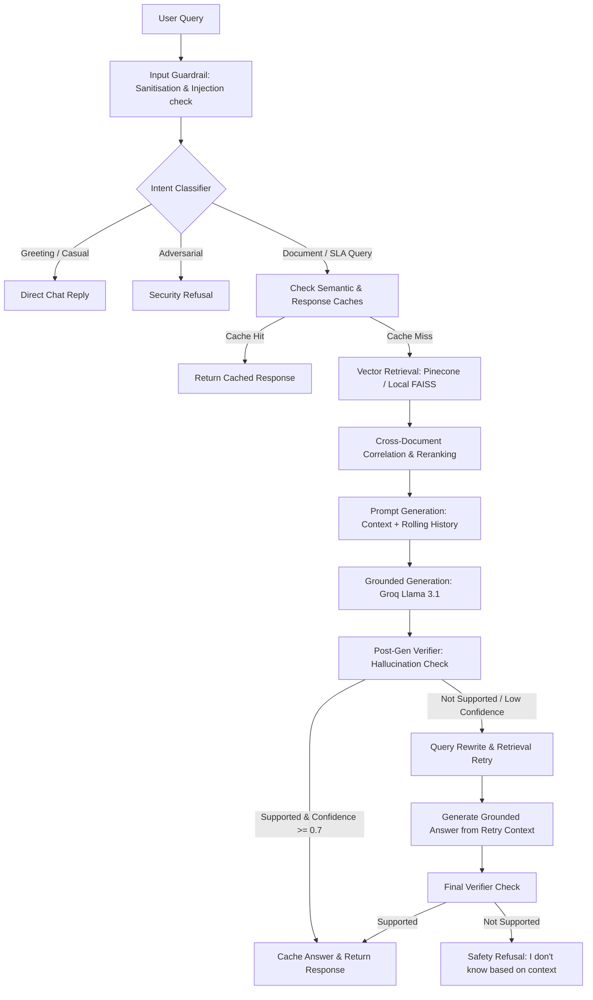

# 🚢 PSI RAG - Production Guardrailed Self-RAG System

Production-grade, document-grounded Self-RAG QA assistant for GlobalFreight Logistics carrier SLAs, customs tariffs, and delay exception policies. Fully integrated with standard developer and collaborative agent protocols (**Model Context Protocol** & **Agent-to-Agent Protocol**).

---

## 🖥️ Live UI Demo Mockup

The Gradio web interface features a side-by-side chat console and a **Request Trace** panel, providing real-time transparency into routing decisions, verifier confidence scores, and vector backends:



---

## 🏗️ System Architecture

The core pipeline processes queries asynchronously through a strict multi-layer execution pipeline:



---

## 🛡️ 10-Layer Security Guardrail Funnel

Protects the inference flow from adversarial prompt injections, off-topic requests, and hallucinated responses:

1. **Input Length Validation**: Limits input payloads to prevent buffer overflows or denial-of-service vector attacks.
2. **Text Sanitisation**: Strips dangerous ASCII null bytes, control codes, and malicious scripts.
3. **Prompt Injection Guard**: Uses regular expression classifiers targeting jailbreak strings (e.g. `"ignore all instructions"`, `"act as if"`).
4. **4-Class Intent Routing**: Classifies queries into `greeting`, `adversarial`, `rag`, or `out_of_domain` to restrict LLM reasoning scope.
5. **Retrieval Score Threshold**: Enforces a minimum cosine similarity score (`0.4`) to prevent retrieving irrelevant chunks.
6. **Cross-Document Correlation**: Performs source-balanced reranking of chunks retrieved from different documents (`SLA`, `tariffs`, `delays`) to ensure comprehensive factual coverage.
7. **Context Limits**: Truncates historical contexts dynamically to fit strict token windows while preserving recent summaries.
8. **Double-Pass Verifier LLM**: Checks every generated response against the raw retrieved chunks for factual support.
9. **Confidence Rating Threshold**: Evaluates the verifier's confidence rating; answers below `0.7` are rewritten and retried.
10. **Bulk Operations Safety Gate**: Prevents automated agents from cancelling more than 3 shipments per 10-minute window.

---

## ⚡ Cache & Memory Hierarchy

Optimizes latency and API token costs via a Redis-backed storage engine with local fallback:

* **Semantic Similarity Cache**: Caches embedding vectors of previous queries. If a new query is semantically similar (cosine score >= 0.95), the cached response is served instantly (< 10ms).
* **Exact Retrieval Cache**: Caches raw vector DB search results for frequently requested topics to bypass vector index queries.
* **Response Cache**: Standard key-value store for direct question-to-answer mappings.
* **Rolling Conversation Memory**: Automatically creates and maintains conversation summaries per user session when dialogue surpasses 5 turns, reducing LLM context overhead.

---

## 🛠️ Fault-Tolerant Fallback Matrix

Ensures 100% service uptime even under severe API rate limits (`429 Quota Exhausted`):

| Component | Default Mode | Fallback Mode (Self-Healing) | Trigger Condition |
| :--- | :--- | :--- | :--- |
| **Vector Store** | **Pinecone Cloud DB** | **Local FAISS Index** | Pinecone credentials missing or client package conflicts |
| **Embedding Engine** | **Google Gemini API** (`text-embedding-004`) | **Local CPU Transformers** (`all-MiniLM-L6-v2`) | Gemini API rate limits or quota exhaustion |
| **LLM Judge / Evaluator** | **Google Gemini** (`gemini-2.0-flash`) | **Groq LLM** (`llama-3.3-70b-versatile`) | Gemini API rate limit or free-tier quota exhaustion |
| **Caching Tier** | **Redis Server** | **In-Memory Thread-Safe Cache** | Redis container unreachable or down |

---

## 🤖 Multi-Protocol Exposing (MCP & A2A)

Exposes the logistics RAG engine to third-party clients and collaborative agents:

### 1. Model Context Protocol (MCP) by Anthropic
Enables developer clients (like Cursor or Claude Desktop) to query documents and trigger RAG pipelines:
* **Exposed Tools**:
  - `search_logistics_docs(query, top_k)`: Retrieve raw matching document chunks.
  - `answer_carrier_question(question, username)`: Run the fully guardrailed RAG QA pipeline.
* **Exposed Resources**:
  - `resource://carrier_sla`: Read carrier SLA reference ([DOC1](rag_docs/rag_docs/DOC1_carrier_sla_agreement.md)).
  - `resource://customs_tariff`: Read India customs reference ([DOC2](rag_docs/rag_docs/DOC2_customs_tariff_reference.md)).
  - `resource://shipment_delay`: Read delay policies ([DOC3](rag_docs/rag_docs/DOC3_shipment_delay_policy.md)).
* **Transports**:
  - **SSE (Server-Sent Events)**: Mounted on FastAPI at `/api/v1/mcp/sse` and `/api/v1/mcp/messages`.
  - **Stdio (Command Line)**: Local transport via `python scripts/run_mcp_stdio.py`.

### 2. Agent-to-Agent (A2A) Protocol by Google
Enables autonomous multi-agent orchestrators to delegate and execute tasks:
* **Endpoints**:
  - `GET /.well-known/agent-card.json`: Discovery metadata card containing capabilities and the `logistics_sla_advisor` skill.
  - `POST /api/v1/a2a/tasks`: Creates a stateful QA task.
  - `GET /api/v1/a2a/tasks/{task_id}`: Polls task state (`created`, `running`, `completed`, `failed`) and fetches output artifacts.
  - `PUT /api/v1/a2a/tasks/{task_id}/execute`: Triggers asynchronous background task execution.

---

## 🚀 Setup & Execution

### 1. Environment Setup
Create a `.env` file from the template:
```bash
cp .env.example .env
```
Populate the keys:
```env
GROQ_API_KEY=your_groq_api_key
GEMINI_API_KEY=your_gemini_api_key
PINECONE_API_KEY=your_optional_pinecone_api_key
REDIS_URL=redis://localhost:6379/0
```

### 2. Installation & Ingestion
Create a virtual environment and run the document ingestion pipeline:
```bash
# Setup virtual environment
python -m venv .venv
source .venv/bin/activate  # Windows: .venv\Scripts\activate
pip install -r requirements.txt

# Ingest and index documents
python scripts/ingest_docs.py --source rag_docs/rag_docs --force
```

### 3. Running Services
```bash
# Start FastAPI backend (FastAPI, MCP SSE, and A2A endpoints)
uvicorn app.main:app --host 0.0.0.0 --port 8000 --reload

# Start Gradio Chat console and Evaluation Dashboard
python app.py

# Run local MCP server over stdio (for Cursor/Claude Desktop integration)
python scripts/run_mcp_stdio.py
```

### 4. Running Tests & Evaluations
```bash
# Run unit tests (includes cache, memory, guardrails, MCP, and A2A tests)
pytest tests/

# Run mock-mode prototype QA evaluation
python scripts/run_eval.py --mock

# Run real Ragas metric evaluation (Faithfulness, Answer Relevancy, Context Precision)
python scripts/run_ragas_eval.py --num-questions 3
```

### 5. Docker Deployment
Spin up the RAG application alongside a persistent Redis caching database:
```bash
docker-compose -f docker/docker-compose.yml up --build -d
```
